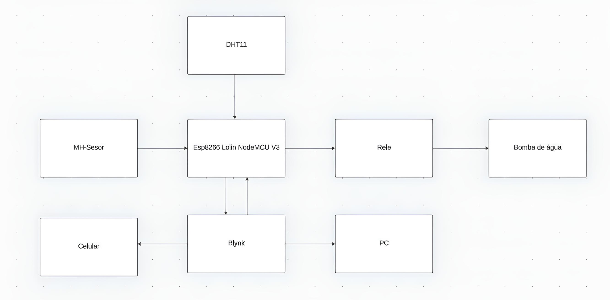
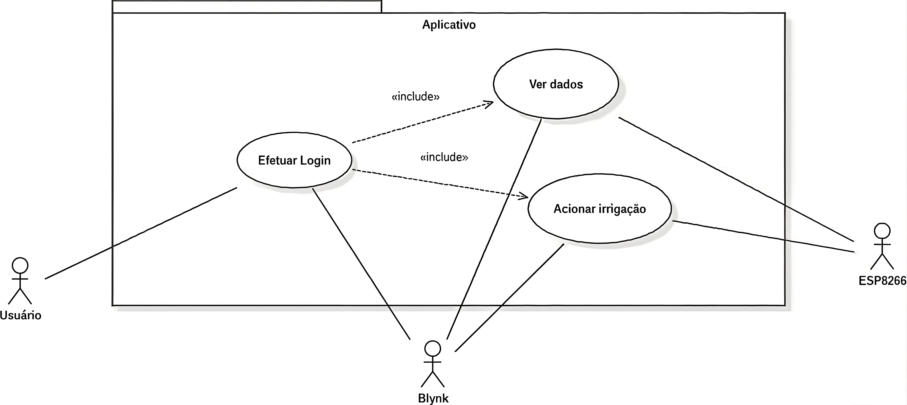
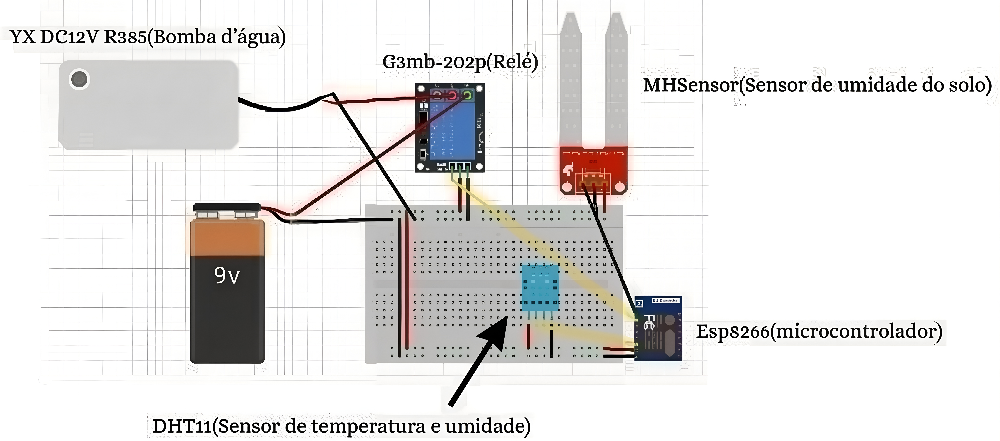
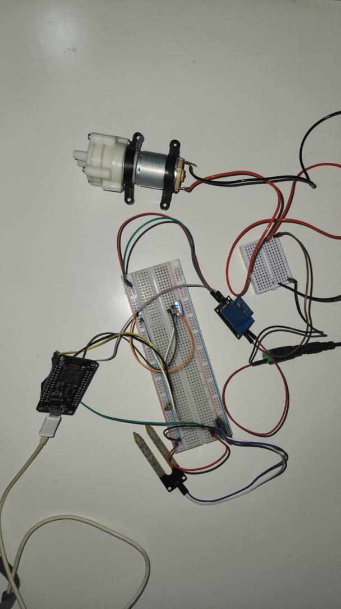
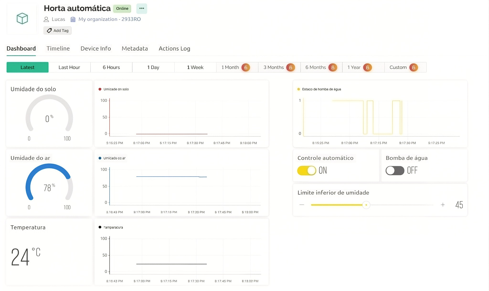
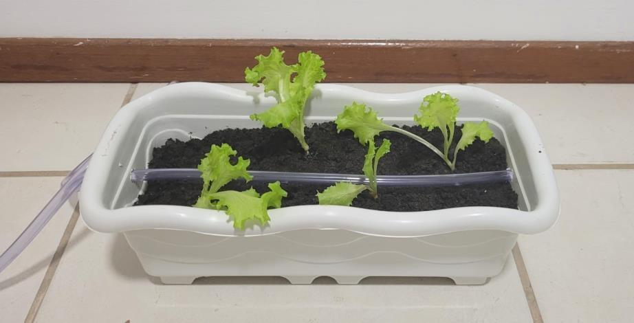

<div align="right">
  🇺🇸 <strong>English</strong> | 🇧🇷 <a href="README.pt-br.md">Português</a>
</div>

# 🌱 Automated Garden Irrigation System

Embedded system for monitoring and automatically irrigating a garden using an **ESP8266**, environmental sensors, and **Wi-Fi** communication with the **Blynk** platform, enabling real-time remote monitoring and control.

---

# 📖 About the Project

This project was developed during the course **Projeto Integrador I (DEC0013)** at the **Federal University of Santa Catarina (UFSC)**.

### Advisors

- Dr. Jim Lau
- Dra. Olga Yevseyeva
- Dra. Andréa Sabedra Bordin

### Authors

- Lucas Porto Ribeiro
- João Victor Pavan
- Nélio Pagani Neto

**Semester:** 2023/2

---

# 🎯 Motivation

Manual garden irrigation depends on the availability and attention of the person responsible for watering the plants. In many situations, forgetting to water or applying an inadequate amount of water can compromise plant development.

This project was developed to automate this process by continuously monitoring garden conditions and performing irrigation only when necessary. Additionally, the system allows all information to be remotely monitored through an application.

The main objectives are:

- Automate garden irrigation;
- Prevent watering mistakes or forgetfulness;
- Improve monitoring of environmental conditions;
- Reduce water waste;
- Facilitate plant cultivation.

---

# 📋 System Overview

The system consists of an automated garden capable of monitoring:

- Ambient temperature;
- Relative air humidity;
- Soil moisture.

All information is collected by the **ESP8266**, which processes the data and communicates via **Wi-Fi** with the **Blynk** platform, allowing users to monitor the garden through a smartphone or computer.

In addition to monitoring, the system can automatically activate a water pump through a relay module whenever soil moisture reaches a minimum threshold configured by the user.

---

# ⚙️ Features

- 🌡️ Ambient temperature monitoring
- 💧 Air humidity monitoring
- 🌱 Soil moisture monitoring
- 🚰 Automatic irrigation
- 📱 Manual control through the application
- 📊 Measurement history
- 🌐 Wi-Fi communication

---

# ✅ Functional Requirements

- RF01 — Store temperature, air humidity, and soil moisture data;
- RF02 — Allow manual irrigation activation;
- RF03 — Automatically activate the water pump according to soil moisture levels;
- RF04 — Allow users to configure the minimum moisture threshold for automatic irrigation.

---

# 🔒 Non-Functional Requirements

- RNF01 — Simple and intuitive interface;
- RNF02 — Adaptable system for different types of plants;
- RNF03 — Access through a mobile application and web dashboard;
- RNF04 — Hardware resistant to the operating environment conditions.

---

# 📜 Business Rules

- RN01 — Only authorized users can access the system.
- RN02 — The system must remain continuously available.
- RN03 — Automatic irrigation only occurs when soil moisture is below the configured threshold.
- RN04 — The user can manually start irrigation at any time.

---

# 💻 Firmware

Libraries used:

- ESP8266WiFi
- BlynkSimpleEsp8266
- DHT
- Adafruit Sensor

The firmware is responsible for:

- Reading sensor data;
- Sending information to the application;
- Receiving user commands;
- Automatically controlling the water pump relay;
- Maintaining Wi-Fi communication.

---

# 🌐 Device Communication

The system operation follows the flow below:

1. Sensors collect environmental measurements.
2. The ESP8266 processes the information.
3. Data is sent to the Blynk server through Wi-Fi.
4. The application displays the information to the user.
5. The user can send irrigation commands.
6. The ESP8266 receives commands and controls the pump relay.

<p align="center">

</p>

---

# 👤 Use Case Diagram

The system has a single main actor: the user.

Through the Blynk application, the user can:

- View temperature;
- View air humidity;
- View soil moisture;
- Configure the minimum moisture threshold;
- Enable or disable manual irrigation.

<p align="center">

</p>

---

# 🔧 Hardware Used

The system was developed using:

- ESP8266 NodeMCU
- DHT11 Sensor
- Soil Moisture Sensor (MH Sensor)
- Relay Module
- Water Pump
- Power Supply
- Irrigation Hose

### Electrical Diagram

<p align="center">

</p>

### Hardware Setup

The image below shows the physical implementation of the system, including the assembly of the ESP8266, sensors, relay module, water pump, and other components used during project validation.

<p align="center">

</p>

---

# 📱 Application Interface

The interface was developed using the **Blynk** platform.

It allows users to:

- View temperature;
- View air humidity;
- View soil moisture;
- Monitor measurement history;
- Turn irrigation on or off manually;
- Configure the minimum soil moisture threshold for automatic irrigation.

### Interface

<p align="center">

</p>

---

# 🌿 Garden Used

During project validation, a 35x15 cm garden containing four lettuce plants was used.

Irrigation was performed through a hose installed in the container and supplied by a water pump controlled by the system. Meanwhile, the sensors continuously monitored ambient temperature, air humidity, and soil moisture.

### Garden

<p align="center">

</p>

---

# 📂 Project Structure

```text
.
├── firmware/
│   └── main.ino
├── docs/
│   └── report.pdf
├── images/
└── README.md

```

---

## 📄 Project Documents

* 📄 **[Project Report](docs/report.pdf)**
* 📊 **[Project Presentation](docs/project_presentation.pptx)**
